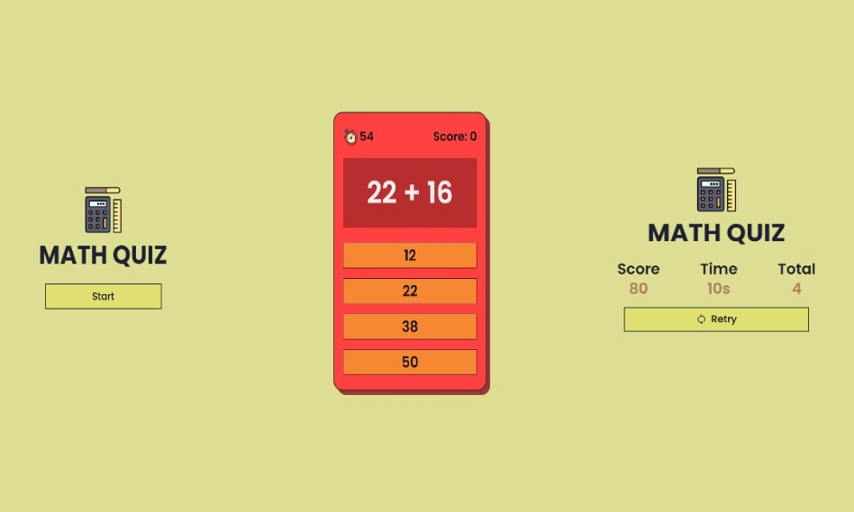

# Math Quiz Game

<a href="https://vocal-brigadeiros-36cf97.netlify.app">Give it a try!🔗</a>

## Overview

The Math Quiz Game is an engaging web-based quiz application designed to test your arithmetic skills. Players answer a series of math questions within a time limit, earning points for each correct answer. The game features a timer, score tracking, and the ability to retry the quiz.

## Features

- **Timed Quiz**: Players have 60 seconds to answer as many questions as possible.
- **Score Tracking**: Points are awarded for each correct answer, and the total score is displayed at the end of the quiz.
- **User Interface**: The game consists of three sections: the introduction screen, the quiz screen, and the results screen.
- **Retry Option**: After finishing the quiz, players can retry the quiz by clicking a button.

## How It Works

### 1. **User Interface Elements**

- `startButton`: Button to start the quiz.
- `refreshIcon`: Icon (not currently used in the provided code) which might be for refreshing or additional functionality.
- `firstSection`: The initial screen showing the start button.
- `secondSection`: The quiz screen where questions and options are displayed.
- `thirdSection`: The results screen showing the final score and time.
- `timeDisplay`: Displays the remaining time.
- `scoreDisplay`: Displays the current score.
- `questionDisplay`: Displays the current quiz question.
- `optionsContainer`: Container for answer buttons.
- `nextButton`: Button to proceed to the next question (not used in the provided code but implied).
- `finalScoreDisplay`: Shows the final score at the end of the quiz.
- `finalTimeDisplay`: Shows the time taken to complete the quiz.
- `totalQuestionsDisplay`: Displays the number of correct answers.
- `retryButton`: Button to restart the quiz.
- `spinner`: Loading spinner displayed while the quiz is starting.

### 2. **Game Flow**

#### Starting the Quiz

- Clicking the `startButton` triggers the `startQuiz` function.
- The `startQuiz` function shows a spinner for 1.5 seconds, hides the `firstSection`, and displays the `secondSection` (quiz screen).
- Initializes the score, question index, and correct answer count. Starts the timer and loads the first question.

#### Loading Questions

- The `loadQuestion` function retrieves the current question from the `quizQuestions` array and displays it along with multiple-choice options.
- Each option is created as a button, and clicking an option triggers the `checkAnswer` function.

#### Answer Checking

- The `checkAnswer` function compares the selected option with the correct answer. If correct, it updates the score and correct answer count.
- Proceeds to the next question or ends the quiz if all questions are answered.

#### Timing

- The `startTimer` function initializes a 60-second countdown, updating the `timeDisplay` every second.
- If time runs out, the timer stops and the quiz ends.

#### Ending the Quiz

- The `endQuiz` function stops the timer, hides the `secondSection`, and displays the `thirdSection` (results screen).
- Displays the final score, time taken, and number of correct answers.

#### Retrying the Quiz

- The `retryQuiz` function hides the `thirdSection` and shows the `firstSection` to restart the quiz.

### 3. **Event Listeners**

- `startButton.addEventListener("click", startQuiz)`: Starts the quiz when clicked.
- `retryButton.addEventListener("click", retryQuiz)`: Restarts the quiz when clicked.

## How to Play

1. Click the "Start" button to begin the quiz.
2. Answer the questions as quickly and accurately as possible.
3. View your score and time taken upon completion.
4. Click "Retry" to play the quiz again.

Enjoy testing your math skills with this interactive quiz game!
